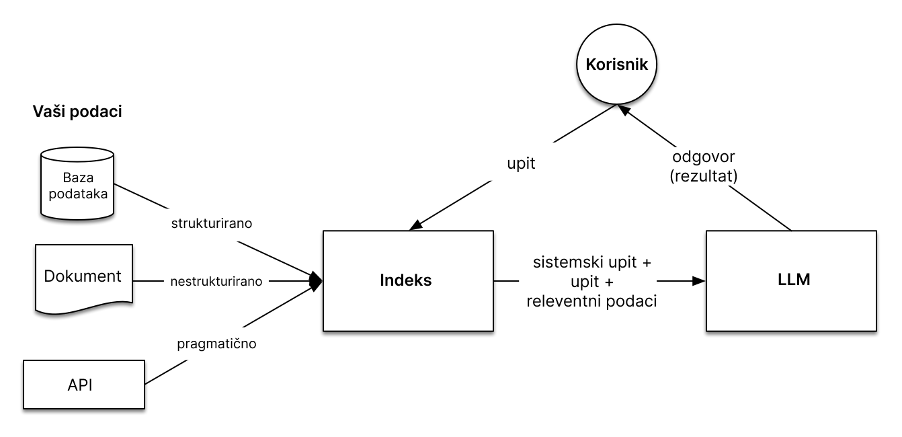

### Starter tutorial za llama-index
Službena dokumentacija ```https://docs.llamaindex.ai/en/stable/index.html```

### Postavljanje
1. Fork i kloniranje repozitorija ```https://docs.github.com/en/pull-requests/collaborating-with-pull-requests/working-with-forks/fork-a-repo```
2. Preimenovati ```.env.temlplate``` file u ```.env``` i postaviti vrijednosti api ključeva za pristup prema OpenAi i Traceloop
3. Kreirati virtualno okruženje ```python -m venv venv``` i aktivirati ```venv\scripts\activate\``` (ovo je komanda za windows)
4. Instalacija svih dependencies-a  ```pip install -r requirements.txt```
5. Tijekom tutoriala se objašnjavaju najbitniji koncepti RAG-a (pogledaj dolje što je to) i načini izgradnje

### Što je llama-index
Llama-Index je podatkovni okvir za izgradnju aplikacija temeljene na LLM-u za unos, strukturiranje i pristup privatnim podacima.

### Zašto llama-index
Dostupni LLM-ovi su trenirani na velikim količinama podataka ali ne i na privatnim podacima ili izborima znanja. Moguće je dotrenirati llm prema svojim podacima ali:
  - može biti skupo, 
  - izazovno da dotreniranje sa novim podacima,
  - nedostaje promatranje rezultata. Kada postavite pitanje jezičnom modelu, nije očito kako je model došao do svojeg odgovora.
  - iziskuje poprilično mnogo vremena

Llama-index ima drugačiji pristup zvan RAG sustav (Retrieval-Augmented Generation hrv. Generiranje uz Pomoć Dohvaćanja).

### Što je RAG?
RAG je sustav u kojem se dohvaćaju informacije iz vlastitog izvora na temelju relevantnosti u usporedbi sa pitanjem.
Postupak: 
  - učitavaju se vlastiti izvori podataka (dokumenti, SQL tablice, API i dr.)
  - na temelju pitanja se dohvaćaju relevantne informacije 
  - pitanje se dodaje kao kontekst
  - traži se odgovor (rezultat) od LLM-a na temelju cjelokupnog upita.



Usporedba sa treniranjem modela:
  - nema treniranja modela stoga nije skupo i iziskuje manje vremena
  - dohvaćanje podataka je na zahtjeb, stoga su uvijek aktualni podaci
  - llama-index ima mogućnost prikazivanja izvora dohvaćenih informacija, stoga je promatranje pouzdanije.

### Stadiji unutar RAG sustava
1. **Učitavanje:** ovo se odnosi na preuzimanje izvornih podataka. Bilo da se radi o tekstualnim datotekama, PDF-ovima, drugoj web stranici, bazi podataka ili API-ju. LlamaHub nudi stotine konektora za odabir.

2. **Indeksiranje:** stvaranje strukture podataka koja omogućuje upite podataka. Za LLM-ove to gotovo uvijek znači stvaranje vektorskih zapisa. Vektorski zapis jest numerički prikaz značenja podataka. Uz to se nadodaju i brojne strategije pretraživanja pomoću metapodataka kako bi se olakšalo pronalaženje relevantnih podataka.

3. **Pohranjivanje:** nakon što se podaci indeksiraju, gotovo ćete uvijek htjeti pohraniti svoj indeks, kao i druge metapodatke, kako biste izbjegli ponovno indeksiranje.

4. **Postavljanje upita:** za bilo koju danu strategiju indeksiranja postoji mnogo načina na koje se mogu koristiti LLM-ovi i strukture podataka Llama-Index-a za postavljanje upita, koje uključuju podupite, upite u više koraka i hibridne strategije.

5. **Evaluacija:** ključni korak u bilo kojem procesu jest provjera učinkovitosti u odnosu na druge strategije ili nakon promjena. Evaluacija pruža objektivne mjere koliko su odgovori na upite točni, pouzdani i brzi.

Tijekom ovo tutoriala će se proći svaki od stadija RAG sustava i još mnogo toga! Za više informacije posjetite službenu dokumentaciju Llama-index-a ```https://docs.llamaindex.ai/en/stable/index.html```


